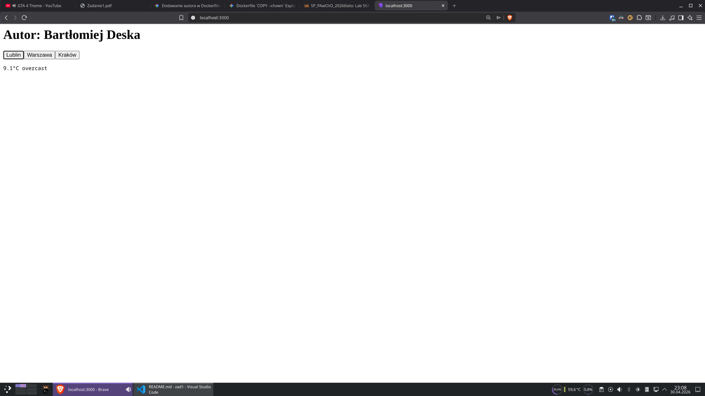

# Budowanie obrazu

```bash
docker build --push -t pan1jan1/smol-server:v1.0 .
```

# Uruchomienie serwera

```bash
docker run -d -p 3000:3000 --name smol-server pan1jan1/smol-server:v1.0
```

# Sposób uzyskiwania informacji z logów

```bash
docker logs smol-server
```

Wynik:

```
30.04.2026
Autor: Bartłomiej Deska
Aplikacja nasłuchuje na porcie 3000
```

# Sposób sprawdzenia ile warstw posiada obraz

```bash
docker image history pan1jan1/smol-server:v1.0
```

```
IMAGE          CREATED          CREATED BY                                      SIZE      COMMENT
ce13fdfffd11   18 seconds ago   ENTRYPOINT ["./server"]                         0B        buildkit.dockerfile.v0
<missing>      18 seconds ago   COPY /app/server ./ # buildkit                  8.93kB    buildkit.dockerfile.v0
<missing>      18 seconds ago   EXPOSE [3000/tcp]                               0B        buildkit.dockerfile.v0
<missing>      18 seconds ago   LABEL org.opencontainers.image.description=V…   0B        buildkit.dockerfile.v0
<missing>      18 seconds ago   LABEL org.opencontainers.image.title=SMOLL-H…   0B        buildkit.dockerfile.v0
<missing>      18 seconds ago   LABEL org.opencontainers.image.authors=Bartł…   0B        buildkit.dockerfile.v0
```

Obraz składa się z tylko jednej warstwy.

# Potwierdzenie działania serwera


